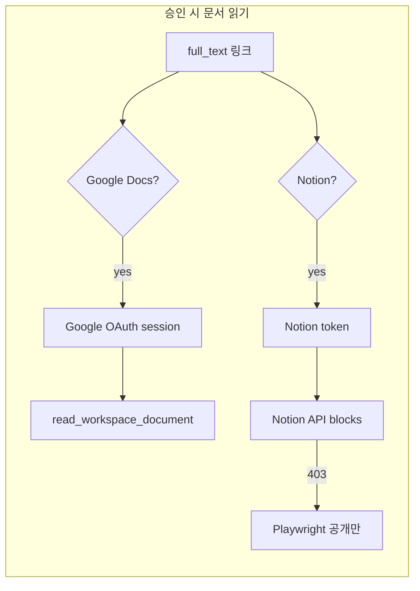

# Notion 인증 리서치 & 구현 계획

## 질문 요약

> inspection_bot에 있는 **Google OAuth**로 Notion 로그인 페이지를 넘길 수 있나?  
> 아니면 **Notion OAuth**를 따로 도입해야 하나?

## 결론 (한 줄)

**Google OAuth는 Notion 읽기에 쓸 수 없다.** Notion API/콘텐츠 접근에는 **Notion 쪽 자격증명**(Internal 토큰, OAuth, 또는 PAT)이 필요하다. Playwright는 “진짜 웹 공개” 또는 **로그인 UI만 긁는 수준**이며, Google 로그인과는 무관하다.

---

## 왜 Google OAuth로는 안 되나

| 구분 | Google OAuth (현재) | Notion 로그인 화면 |
|------|---------------------|-------------------|
| 토큰 발급자 | Google | Notion |
| API | Drive / Docs | Notion REST API |
| inspection_bot 저장 | `gdrive_oauth_tokens` | (없음) |
| Notion “Google로 계속” | — | Notion이 **자기 세션**을 만드는 것일 뿐, 우리 `access_token`과 무관 |

즉, Notion이 Google SSO를 제공해도 **우리 앱의 Google 토큰을 Notion에 넘겨줄 표준 API가 없다.** 브라우저 쿠키도 Google OAuth 응답에 포함되지 않는다.

---

## Notion이 제공하는 인증 방식 (공식)

[Notion Authorization](https://developers.notion.com/guides/get-started/authorization) 기준 3종:

### 1. Internal Integration (`NOTION_API_TOKEN`)

- 워크스페이스 **하나**에 고정된 `secret_...` 토큰
- **페이지마다** integration을 “연결(Add connections)”해야 API 읽기 가능 → 미연결 시 **403**
- **현재 코드 경로** — 승인 시 `read_notion_page()` → Blocks API
- 팀 봇/서버 자동화에 적합, **사용자별 권한 분리는 없음**

### 2. Public Integration + **Notion OAuth 2.0**

- 사용자가 Notion 로그인 → **페이지 피커**로 접근 허용 페이지 선택
- 사용자별 `access_token` (공식 문서상 장기 유효; refresh API도 존재)
- **Google OAuth와 동일한 UX 패턴**으로 inspection_bot에 붙이기 좋음
- `gdrive_oauth_*`와 병렬: `notion_oauth_tokens` + `/api/notion/oauth/login|callback|status`

### 3. Personal Access Token (PAT)

- Developer portal에서 **한 사용자**가 발급, OAuth 없음
- 그 사용자 권한으로 워크스페이스 API 호출
- 내부 도구·관리자 1명이면 OAuth보다 구현이 가벼움 (env/DB에 보관)

---

## Playwright의 위치

```
승인 시 Notion URL
    │
    ├─► API (integration 토큰 또는 OAuth access_token)  ← 본문·구조화에 적합
    │
    └─► Playwright (익명 브라우저)
            ├─ 진짜 공개 페이지 → 본문 가능
            └─ 워크스페이스 로그인 벽 → "Sign in to see this page" (실패에 가깝)
```

- **Google OAuth ≠ Playwright 세션**
- **Notion OAuth access_token**은 **API용**이지, Playwright에 넣을 브라우저 쿠키가 아님 → OAuth 도입 후에도 읽기는 **API 우선**이 맞다.
- Playwright는 integration/OAuth 없이 **완전 공개** 페이지용 **2차 폴백**으로 유지 (코드: `read_notion_page` → API 실패 시 `_read_notion_page_playwright`). Replit Deploy는 포트 5000 선오픈을 위해 Playwright 풀만 **백그라운드** 워밍업.

---

## inspection_bot에 맞는 선택지 비교

| 방안 | 구현량 | 운영 | 적합한 경우 |
|------|--------|------|-------------|
| **A. Internal + 페이지 연결** (현재) | 없음 | Brand OS / Visual OS 루트를 integration에 연결 | 관리자가 연결 가능, 링크가 고정된 OS 문서 |
| **B. Notion OAuth** | 중 (~Google OAuth 복제) | 승인자가 “Notion 연결” 후 피커로 페이지 허용 | 사용자마다 접근 페이지가 다름 / 연결을 봇에 못 줌 |
| **C. PAT 1개** | 소 | PAT 발급자 1명 권한 = 전체 읽기 | 승인 담당 1명, OAuth UI 싫을 때 |
| **D. 페이지를 웹 공개** | 없음 | Notion 공유 설정 변경 | 보안 정책 허용 시 Playwright만으로도 가능 (비권장 단독) |
| **E. Playwright + Notion 로그인 자동화** | 대, 불안정 | — | **비권장** (깨지기 쉬움, 보안·ToS) |

**Age@Labs 로그인 벽**이 보인 이유: 링크가 “웹에서 누구나”가 아니라 **워크스페이스 멤버 전용**이기 때문. 이 경우 **A / B / C** 중 하나가 필요하다.

---

## 권장 로드맵

### Phase 0 — 지금 바로 (코드 변경 최소)

1. Notion에서 **Internal integration** 생성 (또는 기존 `NOTION_API_TOKEN` 확인)
2. **Brand OS v3.0**, **Visual OS 3.0 Sprint** (가능하면 상위 루트) → `Add connections`로 integration 연결
3. `scripts/test_notion_sample.py`로 API 읽기 확인
4. (선택) Playwright 결과에 `Sign in to see this page` 감지 → **hard-fail** (로그인 UI를 본문으로 refine 하는 것 방지)

**성공 기준:** API로 blocks 텍스트 수집, 승인 시 `doc_content`에 실제 OS 내용 반영.

### Phase 1 — Notion OAuth (구현됨)

다음 중 **하나라도** 해당하면 OAuth 사용:

- integration에 OS 페이지를 **연결할 수 없는** 보안 정책
- 승인자마다 **다른 Notion 페이지**만 읽어야 함
- 토큰을 env 하나가 아니라 **로그인한 관리자**에게 묶고 싶음

**구현** (`routers/notion_oauth.py`, `services/notion_auth.py`):

- `GET /api/notion/oauth/login` → Notion authorize (`owner=user`, 페이지 피커)
- `GET /api/notion/oauth/callback` → token exchange → `notion_oauth_tokens`
- `GET /api/notion/oauth/status`, `DELETE /api/notion/oauth/logout`
- 승인 시: `_ensure_tokens_for_docs` → OAuth 세션 토큰 > `NOTION_API_TOKEN` > 412 `notion_auth_required`
- `read_notion_page(url, notion_token=...)` → API → Playwright

**주의:** OAuth는 연결 시 **피커에서 선택한 페이지(+자식)** 만 API 접근. 새 최상위 페이지는 재연결·상위 선택 필요.

### Phase 2 — 품질

- 로그인 벽 / 빈 본문 감지
- OAuth 후에도 403이면 메시지: “승인 시 Notion 페이지 피커에서 이 페이지를 선택했는지 확인”
- (선택) 상위 페이지 1회 연결로 하위 링크 커버되는지 운영 가이드 정리

---

## Google OAuth vs Notion OAuth — 역할 분담 (최종)



| 링크 | 필요한 인증 |
|------|-------------|
| `docs.google.com` | **Google OAuth** (기존) |
| `notion.so` | **Notion Internal / OAuth / PAT** — Google 아님 |

---

## 결정 가이드

| 상황 | 추천 |
|------|------|
| OS 문서가 팀 공용, integration 연결 가능 | **Phase 0만** |
| 연결 불가, 승인자 1~2명 | **PAT (Phase 0 변형)** 또는 **Notion OAuth** |
| 승인자마다 다른 Notion 권한 | **Notion OAuth (Phase 1)** |
| “Google 로그인했으니 Notion도 될 것” | **불가** — Notion 별도 연결 필요 |

---

## 참고 링크

- [Authorization](https://developers.notion.com/guides/get-started/authorization)
- [Public connections (OAuth)](https://developers.notion.com/guides/get-started/public-connections)
- [Create a token](https://developers.notion.com/reference/create-a-token)
- [Working with page content](https://developers.notion.com/guides/data-apis/working-with-page-content)
